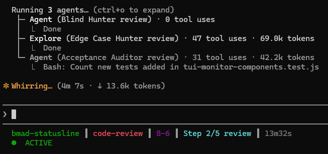
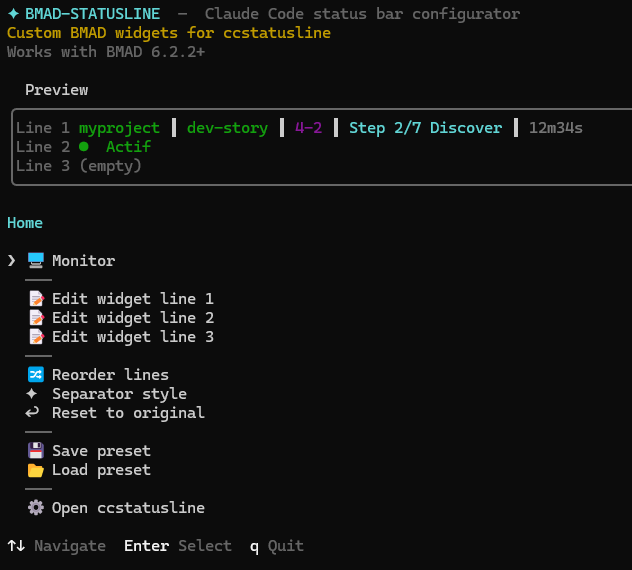
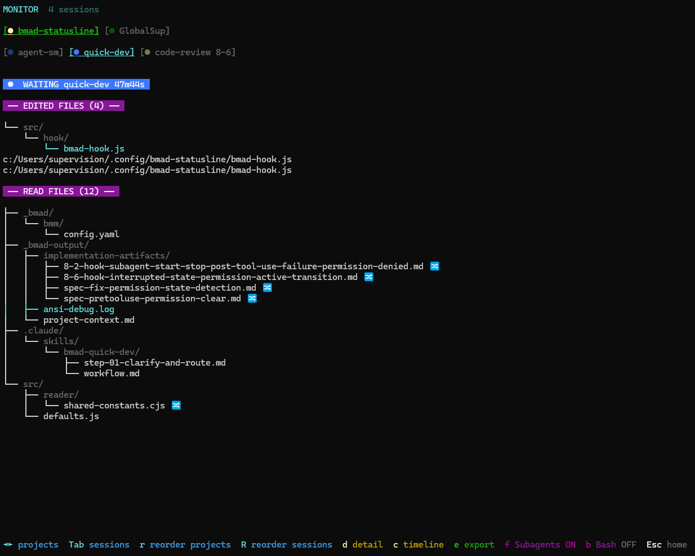

# bmad-statusline

[](https://www.npmjs.com/package/bmad-statusline)
[](LICENSE)
[](package.json)

Pack de custom widgets pour [ccstatusline](https://github.com/sirmalloc/ccstatusline) qui ajoute le suivi passif de l'activité BMAD dans la barre de statut [Claude Code](https://claude.ai/code) — détecte automatiquement le skill actif, la story en cours, la progression des étapes et l'état du LLM, sans aucune action manuelle. Inclut un monitor temps réel pour suivre en direct toutes vos sessions BMAD depuis un terminal séparé.

> **Note :** L'affichage dans le terminal est assuré par [ccstatusline](https://github.com/sirmalloc/ccstatusline), un moteur de status line pour Claude Code. bmad-statusline fabrique et injecte ses propres custom widgets dans ccstatusline. D'autres widgets (non-BMAD) sont disponibles directement dans ccstatusline.

## Status Line

<!-- Capture du rendu des 3 lignes de widgets dans le terminal -->


## Fonctionnalités

- **Détection passive via hooks** — 8 signaux interceptés du cycle de vie Claude Code (prompts, lectures, écritures, bash, permissions, erreurs…). Zéro action manuelle requise.
- **11 widgets configurables sur 3 lignes** — LLM State, Project, Initial skill, Active Skill, Story, Step, Next Step, Document, File Read, File Write/edit, Timer
- **Couleurs sémantiques** — chaque workflow et chaque projet a sa couleur (cyan = dev, vert = planning, jaune = product, magenta = architecture…), personnalisable individuellement
- **TUI configurateur interactif** — éditeur visuel complet pour personnaliser l'affichage, les couleurs, les séparateurs et l'ordre des widgets
- **Monitor temps réel** — dashboard multi-session intégré pour suivre en direct toutes les sessions BMAD actives, historique des fichiers lus/écrits/édités et commandes (voir section [Monitor](#monitor))
- **Presets** — 3 slots pour sauvegarder et charger des layouts complets
- **134 workflows reconnus** — compatibilité BMAD, GDS, WDS, CIS et TEA

## Prérequis

- Node.js >= 20
- [ccstatusline](https://github.com/nicobailon/ccstatusline) >= 2.2
- Un framework BMAD compatible ([BMAD](https://bmadcode.github.io/BMAD-METHOD/), GDS, WDS)

## Installation

```bash
npx bmad-statusline install
```

Configure automatiquement :

- `~/.claude/settings.json` — commande statusLine + entrées hooks
- `~/.config/ccstatusline/settings.json` — définitions des widgets BMAD
- `~/.config/bmad-statusline/` — reader, hook et configuration interne
- `~/.cache/bmad-status/` — répertoire de cache runtime

## TUI Configurateur

```bash
npx bmad-statusline
```

<!-- Capture de l'écran d'accueil du TUI -->


Le TUI permet de personnaliser entièrement l'affichage de la status line sans éditer de fichiers :

### Edit Line

Chaque ligne (1, 2, 3) se configure individuellement :
- **Visibilité** — afficher/masquer chaque widget avec `h`
- **Couleur** — parcourir les 15 couleurs ANSI avec `←/→`, ou passer en mode dynamique (couleur résolue à l'exécution selon le workflow/projet)
- **Ordre** — réorganiser les widgets au sein d'une ligne en mode grab (`g`)
- **Mode d'affichage** — certains widgets ont des modes alternatifs (Story : compact/full)

### Separator Style

4 styles de séparateur entre widgets :
- **Serré** — `projet│dev-story│4/12`
- **Modéré** — `projet │ dev-story │ 4/12`
- **Large** — `projet  │  dev-story  │  4/12`
- **Custom** — chaîne de caractères libre

### Reorder Lines

Réorganiser l'ordre des 3 lignes par drag-and-drop clavier.

### Presets

3 slots de sauvegarde pour stocker des layouts complets (widgets, ordre, séparateurs). Les couleurs personnalisées sont préservées séparément.

## Monitor

<!-- Capture du monitor en action -->


Le Monitor est un dashboard temps réel intégré au TUI qui permet de suivre en direct l'activité de toutes les sessions Claude Code actives. C'est un outil à part entière, accessible depuis le menu principal du TUI.

### Vue d'ensemble

Le Monitor affiche pour chaque session :
- Le **workflow actif** et la **story** en cours
- L'**état du LLM** en temps réel (Active, Permission, Waiting, Error, Interrupted)
- L'**arborescence des fichiers** lus et édités
- L'**historique des commandes** bash exécutées
- Le **temps écoulé** depuis le début de la session

### Multi-session & Multi-projet

- Jusqu'à **20 sessions simultanées** suivies en parallèle
- **Navigation à deux niveaux** : onglets projets (quand plusieurs projets actifs) + onglets sessions
- Chaque onglet affiche le nom du workflow, le numéro de story et un indicateur d'état coloré (●)
- Navigation fluide avec `←/→` entre sessions/projets et `Tab` pour cycler
- Détection automatique de vivacité par vérification PID du processus Claude

### LLM Badge

Bandeau sticky affiché en permanence avec :
- **État** : indicateur coloré sur 5 états
  - 🟢 **Active** — le LLM travaille
  - 🟡 **Permission** — en attente de confirmation utilisateur
  - 🔵 **Waiting** — inactif, contrôle rendu à l'utilisateur
  - 🔴 **Error** — erreur détectée
  - 🟡 **Interrupted** — session interrompue
- **Timer** — temps écoulé mis à jour chaque seconde
- **Contexte** — nom du workflow + numéro de story ou nom de document

### File Tree

- **Arborescence hiérarchique** pour les fichiers du projet (├──, └──, │)
- **Liste plate** pour les fichiers hors projet
- **Indicateurs visuels** :
  - `*` (vert) — fichier nouvellement créé pendant la session
  - 🔀 (cyan) — fichier modifié par un sub-agent
- Le fichier le plus récent est mis en surbrillance

### Bash Commands

- **Historique dédupliqué** — les commandes identiques sont groupées avec compteur (`npm test (x3)`)
- **Coloré par famille** :
  - `npm` → vert, `git` → jaune, `node` → cyan
  - `python/pip` → bleu, opérations fichier → grisé, autres → magenta
- **Support multi-ligne** — les heredocs et commandes longues sont affichés correctement
- La dernière commande exécutée est mise en surbrillance

### Detail Mode

En appuyant sur `d`, on entre en mode détail avec navigation curseur :
- **Fichier édité** — affiche tous les diffs (lignes supprimées en rouge, ajoutées en vert)
- **Fichier lu** — liste tous les horodatages de lecture
- **Commande** — historique complet de chaque exécution

### Chronology

Vue timeline fusionnée de toutes les opérations (lectures, écritures, éditions, commandes bash) :
- **Tri** — basculer entre alphabétique et chronologique avec `s`
- **Format horaire** — basculer entre absolu (HH:MM:SS) et relatif ("il y a 5min") avec `t`
- **Indicateurs de type** — READ (cyan), WRITE (vert), EDIT (jaune), BASH (grisé)

### Export CSV

Exporter les données de session en CSV :
- **Light** — résumé agrégé (type, chemin, compteur)
- **Full** — détail complet (type, chemin, opération, horodatage, contenu)

## Commandes

| Commande | Description |
|----------|-------------|
| `npx bmad-statusline` | Lancer le TUI configurateur |
| `npx bmad-statusline install` | Installer widgets, reader et hooks |
| `npx bmad-statusline uninstall` | Supprimer tous les composants |
| `npx bmad-statusline clean` | Nettoyer les fichiers de cache périmés |

## Comment ça marche

bmad-statusline repose sur une architecture en 3 couches :

1. **Hooks** — interceptent les événements du cycle de vie Claude Code (8 signaux : UserPromptSubmit, PreToolUse, PostToolUse, PermissionRequest, Stop, StopFailure, SubagentStart/Stop) pour détecter passivement le skill actif, la story, la progression des étapes et l'état du LLM
2. **Cache** — les données sont stockées en JSON dans `~/.cache/bmad-status/` (un fichier status + un fichier alive par session)
3. **Reader** — lit le cache et produit une ligne formatée avec couleurs ANSI pour que ccstatusline l'affiche

Tout est synchrone, sans dépendances runtime (Node.js stdlib uniquement pour hook et reader), et conçu pour ne jamais interférer avec le fonctionnement de Claude Code.

> **Note :** En raison d'une limitation de Claude Code, la status line ne se rafraîchit que lorsque le LLM effectue des actions (appels d'outils, lectures, écritures…). Cela impacte principalement l'indicateur d'état LLM et le Timer, qui peuvent sembler figés lorsque le LLM est inactif ou en attente d'une action utilisateur.

## Configuration

Les fichiers de configuration se trouvent dans `~/.config/bmad-statusline/` :
- `config.json` — configuration des widgets, couleurs, séparateurs et presets

Deux variables d'environnement permettent de personnaliser les chemins :
- `BMAD_CACHE_DIR` — répertoire de cache (défaut : `~/.cache/bmad-status/`)
- `BMAD_CONFIG_DIR` — répertoire de configuration (défaut : `~/.config/bmad-statusline/`)

## Désinstallation

```bash
npx bmad-statusline uninstall
```

Supprime proprement tous les composants : hooks, widgets ccstatusline, reader, scripts et fichiers de cache.

## License

[MIT](LICENSE)
