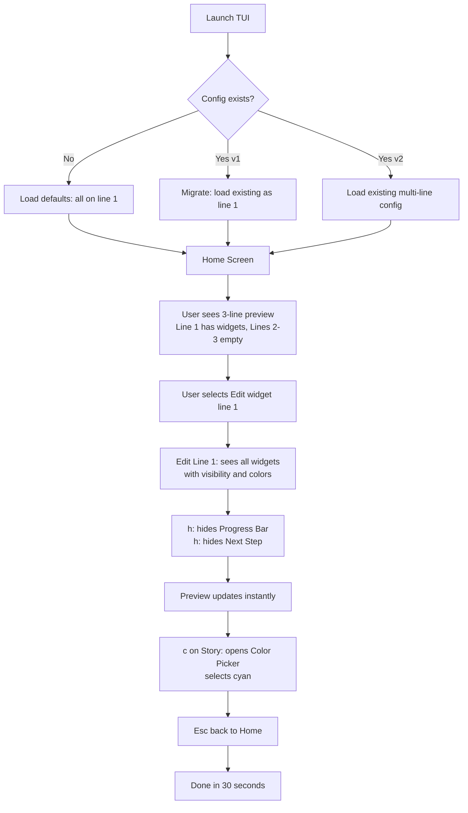
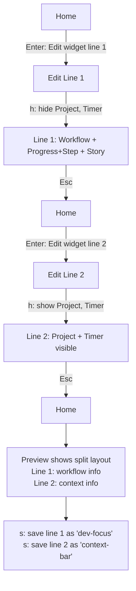
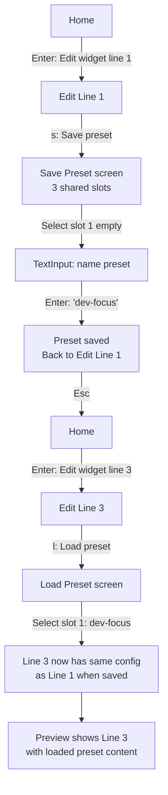
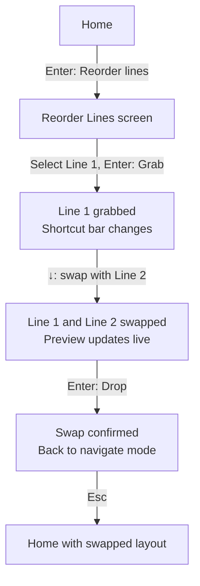
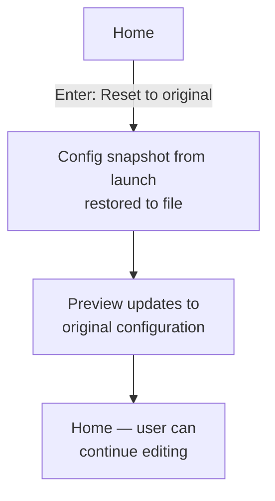

# UX Design Specification bmad-statusline

**Author:** Fred
**Date:** 2026-03-30
**Revision:** 2 — TUI v2 (multi-line model)

---

## Executive Summary

### Project Vision

A comprehensive redesign of the bmad-statusline TUI configurator, moving from the v1 modal/wizard model (single-line focus, deep navigation tree, dual-pattern preview) to a **multi-line model** where the user manages up to 3 ccstatusline lines independently. Built with React 19 + Ink 6.8 + @inkjs/ui 2.0, 100% keyboard-driven, with a friendlier visual identity.

The core insight: **ccstatusline receives opaque composite blocks (one per line), while bmad-statusline manages widget granularity internally.** Users configure individual widgets (visibility, order, colors) per line in the TUI, but ccstatusline only sees a single composite command per line — keeping its own configurator clean.

The v2 TUI introduces a 3-line live preview in a boxed frame at the top of every screen, per-line widget editing with inline shortcuts, per-line presets from a shared pool, line content swapping, and measured emojis and colors for a friendlier experience.

**Job-to-be-done:** "I want to see my statusline as I imagine it, across 3 lines, in 60 seconds, without reading any documentation."

### Target Users

Developers using Claude Code with the BMAD framework. High technical proficiency, terminal-native, expect fast and predictable keyboard-driven interactions. They are familiar with ccstatusline's TUI conventions (modal workflows, contextual shortcuts). They appreciate a clean, friendly interface that doesn't waste their time.

### Key Design Challenges

1. **Multi-line mental model** — The user must understand they are configuring 3 independent lines, each with its own widgets, order, and colors. The 3-line preview makes this self-evident — but the transition from "configure one line" to "configure three lines" must be frictionless.

2. **Flat navigation** — v1's 4-level depth (Home > Widgets > widget > Color Mode > Fixed) was disorienting. v2 collapses to 2 levels max (Home > Edit Line N), with all widget actions available inline via keyboard shortcuts. The challenge is fitting enough functionality into a flat structure without overwhelming the shortcut bar.

3. **Per-line presets** — Presets save/load a single line's configuration from a shared pool of 3 slots. The user must understand that saving captures the current line only, and loading replaces the current line only. The shared pool concept (any line can use any preset) must be intuitive.

4. **Visible navigation tree** — A discreet breadcrumb (single greyed line) displayed at the top of every screen showing the user's exact position (e.g., `Home > Edit Line 1 > Color: Workflow`). Must stay sober — orientation aid, not visual focus.

### Design Opportunities

1. **3-line boxed preview** — A framed preview at the top of every screen showing all 3 ccstatusline lines. The user sees the combined result at all times, across all lines. Instant understanding of the multi-line layout.

2. **Inline widget actions** — Single-letter shortcuts (h, g, c, s, l) directly from the widget list. No sub-screens for common actions. The Edit Line screen is the workhorse — most configuration happens there.

3. **Discreet breadcrumb** — A single greyed line answering "where am I?" across all navigation depths. Shallow tree (max 2 levels) means the breadcrumb is mostly cosmetic, but it prevents any possible confusion.

4. **Friendlier visual identity** — Measured emojis in menu items, ANSI colors for visual hierarchy, vertical spacing between sections. The TUI is still a utility, but it doesn't need to be austere.

## Core User Experience

### Defining Experience

The core interaction loop is **choose line → configure widgets → see preview → repeat for other lines**. The user selects which line to edit, makes changes via inline shortcuts (hide/show, reorder, color, presets), and the 3-line preview updates instantly. When satisfied, they move to another line or quit. This loop must be frictionless — the preview IS the feedback.

### Platform Strategy

- **Platform:** Terminal only (CLI tool)
- **Stack:** React 19 + Ink 6.8 + @inkjs/ui 2.0 (Select, TextInput, StatusMessage)
- **Input:** 100% keyboard — no mouse, no touch
- **Constraint:** Limited vertical terminal space — every line must earn its place
- **Deployment:** Invoked via CLI command (`npx bmad-statusline`), runs in the user's terminal session

### Effortless Interactions

- **Navigation:** Escape always goes back, Enter always goes forward. Universal, predictable, no exceptions.
- **Preview:** Always visible on every screen in a boxed frame at the top — the user never needs to navigate somewhere to "check" their changes.
- **Orientation:** Breadcrumb always present — the user never wonders "where am I?"
- **Inline actions:** Most widget configuration happens without leaving the Edit Line screen — h/g/c/s/l shortcuts keep the user in flow.
- **Persistence:** Every choice anchors immediately — no save action, no confirmation dialogs. The system feels like direct manipulation.

### Critical Success Moments

- **Aha moment:** The first time the user edits line 1 and line 2 independently and sees the 3-line preview update with different widgets on each line. They understand the multi-line model instantly.
- **Fatal failure:** Confusion about which line they're editing, or presets overwriting all lines instead of just the current one. The breadcrumb and preview must prevent both.

### Experience Principles

1. **One screen, one scope** — Each screen operates on a clear scope: a specific line, or a global setting. No mixing concerns.
2. **Show, don't explain** — The 3-line boxed preview makes widget layout self-evident. No tooltips, no documentation needed.
3. **Always oriented** — Breadcrumb + Escape guarantee the user always knows where they are and how to get back.
4. **Instant feedback** — Every interaction produces immediate visible change in the preview. The choose → see loop has zero delay.
5. **Keyboard vocabulary** — Consistent shortcuts across all screens, following ccstatusline conventions. Muscle memory transfers.
6. **Friendly but not noisy** — Measured emojis and colors add warmth without cluttering. The preview remains the visual focal point.

## Desired Emotional Response

### Primary Emotional Goals

- **In control** — "I know exactly where I am and what I'm doing." The flat navigation, breadcrumb, and Escape-always-goes-back pattern ensure the user never feels lost.
- **Efficient** — "Done. Fast. Back to coding." The TUI is a utility, not a destination. 60-second job-to-be-done, then exit.
- **Confident** — "I can see it across all 3 lines, so I know it's right." The 3-line boxed preview removes all guesswork — the user trusts their configuration because they see the complete layout.

### Emotional Journey Mapping

| Stage | Desired Feeling | Design Driver |
|-------|----------------|---------------|
| Launch | Oriented — "I see my 3 lines, I know what to do" | Home screen with 3-line preview + clear menu |
| Navigation | In control — "I'm editing line 2, I see it" | Breadcrumb + preview shows active line context |
| Configuration | Confident — "The preview shows exactly what I changed" | Instant preview update on every shortcut action |
| Multi-line setup | Empowered — "Each line does its own thing" | Independent per-line editing, preview shows all 3 |
| Exit | Satisfied — "That was quick" | No save step, just quit — it's already done |

### Emotions to Eliminate

- **Lost/confused** — Risk shifts from deep navigation (v1) to multi-line confusion. Eliminated by clear breadcrumb ("Edit Line 2"), preview showing all 3 lines, and per-line scope in every interaction.
- **Anxious** — "Did my change save? Did I break another line?" Eliminated by immediate persistence + per-line isolation + Reset to original safety net.
- **Overwhelmed** — "Too many shortcuts!" Eliminated by progressive discovery — the shortcut bar shows only what's relevant to the current screen.

### Emotional Design Principles

1. **Utility with warmth** — This is a tool, but it can be friendly. Measured emojis and colors add personality without sacrificing clarity.
2. **Transparency builds confidence** — Show all 3 lines, not a promise. The preview is the source of trust.
3. **Predictability beats cleverness** — Consistent shortcuts and navigation patterns across all screens. No context-dependent surprises.

## UX Pattern Analysis & Inspiration

### Inspiring Products Analysis

**ccstatusline TUI** — The primary design reference. bmad-statusline must feel like a natural extension of ccstatusline's TUI, not a separate tool. Users should transfer their muscle memory directly.

Key ccstatusline UX patterns analyzed:
- **Modal workflows** — Each action opens a dedicated context with its own shortcuts. One task per view.
- **Widget picker** — Selection list with contextual single-letter shortcuts (h=hide, a=alignment). Actions available directly from the list without entering a sub-screen.
- **Minimal information density** — Few elements per screen, large focus on the current task.
- **100% keyboard navigation** — Arrow keys for movement, Enter for selection, Escape for back.

### Transferable UX Patterns

| ccstatusline Pattern | bmad-statusline v2 Application |
|---------------------|----------------------------|
| Modal workflow per action | Each line gets its own Edit screen; global settings (separator, reorder, reset) get their own screens |
| Widget picker with inline shortcuts | Edit Line screen with h=hide/show, g=grab, c=color, s=save preset, l=load preset |
| Escape = always back | Universal back navigation across all depth levels |
| Minimal info per screen | One scope per screen + breadcrumb + 3-line preview |
| Contextual shortcut bar | Bottom line showing available shortcuts for current screen |

### Anti-Patterns to Avoid

1. **Deep navigation tree** — v1's 4-level depth for color configuration. v2 caps at 2 levels (Home > Edit Line, or Home > Edit Line > Color Picker).
2. **Heterogeneous navigation** — Each screen must follow the same interaction contract.
3. **Auto-dismiss feedback** — Errors should persist until the user acknowledges them.
4. **Line scope confusion** — Never let the user accidentally modify a line they didn't intend to edit. Breadcrumb and preview make scope explicit.

### Design Inspiration Strategy

**Adopt directly:**
- Modal one-scope-per-screen model
- Contextual single-letter shortcuts from list views
- Escape = back, Enter = select, arrows = navigate
- Minimal information density

**Adapt for bmad-statusline v2:**
- **3-line boxed preview** — ccstatusline has a single preview concept. bmad-statusline needs 3 lines in a box to show the multi-line layout. New display, same "show don't explain" spirit.
- **Breadcrumb** — Shallow tree (max 2 levels) makes it mostly cosmetic, but it's insurance against confusion.
- **Inline widget actions** — ccstatusline uses single-letter shortcuts from list views. bmad-statusline extends this with g=grab, s=save, l=load directly from the widget list.

**Avoid:**
- Any interaction pattern not present in ccstatusline unless justified by a bmad-statusline-specific constraint (multi-line model, presets).

## Design System Foundation

### Design System Choice

**Terminal-native component system** — No external design system applies. The design foundation is the Ink + @inkjs/ui component library, constrained to terminal capabilities (ANSI colors, box-drawing characters, text-only rendering).

### Rationale for Selection

- **No choice to make** — The stack (React 19 + Ink 6.8 + @inkjs/ui 2.0) is fixed. The terminal is the platform. ANSI is the palette.
- **ccstatusline alignment** — ccstatusline uses the same Ink stack. Using identical components ensures visual and behavioral consistency.
- **Zero custom interaction components needed** — @inkjs/ui provides Select, TextInput, and StatusMessage. Custom components are layout/composition only.

### Implementation Approach

**Screen layout template** — Every screen follows the same vertical structure:

```
Line 1: Breadcrumb (greyed)              Home > Edit Line 1
         (empty separator)
         Preview
         ┌──────────────────────────────────────────────┐
         │  Line 1: project · dev-story · Tasks 2/5     │
         │  Line 2: 12:34                                │
         │  Line 3:                                      │
         └──────────────────────────────────────────────┘
         (empty separator)
         Content area                    [Select / widget list / info]
         (empty separator)
         Shortcut bar (greyed)           ↑↓ Navigate  h Hide/Show  Esc Back
```

The 3-line boxed preview sits at the top (below breadcrumb), making it the first thing the user sees. The preview is the design system's centerpiece — muted chrome recedes around it.

### Customization Strategy

**Visual conventions across all screens:**

- **Breadcrumb:** Dim/grey text, separator `>`
- **Preview box:** Border characters (Box component), 3 lines inside with actual ANSI widget colors. Label "Preview" above the box.
- **Active selection:** Ink's built-in highlight (inverted colors)
- **Shortcut bar:** Dim/grey text, key names in bold/white
- **Error messages:** StatusMessage component with error type, persists until user presses any key
- **Content area:** @inkjs/ui Select with default styling, or custom widget list with inline status
- **Emojis:** Measured use in menu item labels and screen headers. Never in data or preview. Never more than one per line.
- **Colors:** ANSI colors for visual hierarchy — screen titles in bold, hidden widgets in dim text.

## Defining Core Experience

### Defining Experience

**"Pick a line, tweak its widgets, see all 3 lines update."** The user operates on one line at a time through the Edit Line screen. Each Edit Line screen is a self-contained workspace: see all widgets, hide/show them, reorder them, change colors, save/load presets — all via inline shortcuts without leaving the screen. The 3-line boxed preview shows the combined result across all lines at all times.

This is the interaction users would describe: "You pick which line, mess with the widgets, and see it right there in the box."

### User Mental Model

The user thinks in terms of **3 configurable lines** with shared tools:

```
Home
├── 📝 Edit widget line 1 (widget list + h/g/c/s/l shortcuts)
│   └── Color Picker (sub-screen, when pressing 'c')
│   └── Preset Save/Load (sub-screen, when pressing 's' or 'l')
├── 📝 Edit widget line 2
├── 📝 Edit widget line 3
├── 🔀 Reorder lines (swap line contents)
├── ✦ Separator style (global)
└── ↩ Reset to original
```

Maximum depth: **2 levels** (Home > Edit Line > Color Picker or Preset). Down from v1's 4 levels. The mental model is **spatial** — "I'm editing one of 3 lines" — not a deep tree to descend.

### Success Criteria

| Criteria | Measure |
|----------|---------|
| Orientation | User always knows which line they're editing (breadcrumb + preview) |
| Reversibility | Escape always goes back one level, no exceptions |
| Feedback | Preview updates within the same render cycle as the selection |
| Speed | Multi-line configuration achievable in under 60 seconds |
| Learnability | Zero documentation needed — shortcuts visible on every screen |
| Transfer | ccstatusline users feel immediately at home |
| Multi-line clarity | User never accidentally edits the wrong line |

### Novel UX Patterns

**No novel interaction paradigms.** The inline shortcuts are established ccstatusline vocabulary. The only additions are **display** innovations:

1. **3-line boxed preview** — Showing 3 preview lines in a framed box at the top. Novel display, but the interaction (act → see) is unchanged.
2. **Breadcrumb** — Familiar web pattern adapted to terminal. Less necessary in v2 (max 2 levels) than v1 (4 levels), but kept for consistency.

Both additions are **passive** — the user doesn't interact with them. They observe them. The interaction vocabulary remains 100% ccstatusline.

### Experience Mechanics

**1. Initiation:**
- User runs CLI command (`npx bmad-statusline`)
- TUI launches, loads current config, takes snapshot for Reset
- Home screen displays: 3-line boxed preview + 6 menu options

**2. Interaction (per screen):**
- Arrows navigate the list, Enter or letter shortcut acts
- On Edit Line: h toggles visibility, g grabs to reorder, c opens color picker, s saves preset, l loads preset
- On sub-screens (Color Picker, Preset): Enter selects, Escape returns to Edit Line

**3. Feedback:**
- Preview box updates on every change (same render cycle)
- Breadcrumb updates on every screen transition
- Shortcut bar shows available actions for current screen
- No confirmation dialogs, no success toasts — the preview IS the feedback

**4. Completion:**
- User presses Escape to unwind to Home, or quits directly (q / Ctrl+C)
- No save step — all changes already persisted
- TUI exits cleanly to terminal

## Visual Design Foundation

### Color System

**Terminal ANSI only** — 16 standard colors. No custom palette possible.

**TUI chrome colors (the TUI's own interface, not widget configuration):**

| Element | ANSI Treatment | Rationale |
|---------|---------------|-----------|
| Breadcrumb | Dim (grey) text | Orientation aid, not focus — must recede |
| Screen title | Bold white | Current context — must stand out |
| Menu items | Default text + measured emoji prefix | Content — neutral, readable, friendly |
| Active selection | Inverted (Ink default) | Focus indicator — highest contrast |
| Hidden widgets | Dim text | Visually recede vs visible widgets |
| Shortcut bar | Dim text, bold white for keys | Available but not distracting |
| Preview box | Border characters + actual ANSI widget colors inside | The preview IS the config — focal point |
| Error messages | Red via StatusMessage | Standard terminal convention |

**Emoji usage rules:**
- One emoji per menu item label maximum (e.g., "📝 Edit widget line 1")
- Never in data, preview content, or shortcut bar
- Never more than one per text line
- Consistent emoji per action type across screens

**Principle:** The TUI chrome is deliberately **muted** (dim, default) so that the 3-line boxed preview — rendered with the user's actual color configuration — is the visual focal point of every screen.

### Typography System

**Monospace only** — Terminal font is user-controlled. No font choices to make.

**Text hierarchy via ANSI attributes:**

| Level | Attribute | Usage |
|-------|-----------|-------|
| H1 | Bold | Screen title |
| Body | Default | List items, descriptions |
| Meta | Dim | Breadcrumb, shortcut bar, labels |
| Emphasis | Bold | Key names in shortcut bar, selected values |
| Alert | Red + Bold | Error messages |
| Friendly | Emoji prefix | Menu items (measured) |

### Spacing & Layout Foundation

**Character grid** — All spacing measured in characters (width) and lines (height).

**Vertical structure (every screen):**

```
[1 line]  Breadcrumb
[1 line]  Empty separator
[1 line]  "Preview" label
[5 lines] Preview box (top border + 3 content lines + bottom border)
[1 line]  Empty separator
[N lines] Content area (Select/widget list — fills available space)
[1 line]  Empty separator
[1 line]  Shortcut bar
```

**Spacing rules:**
- 1 empty line between structural sections (breadcrumb, preview, content, shortcuts)
- Preview box always occupies 5 lines (frame + 3 content lines)
- No horizontal padding beyond Ink's default Box padding
- Content area is the only variable-height zone — it stretches to fill available terminal height

### Accessibility Considerations

- **Contrast:** Dim text on terminal backgrounds may be hard to read on some terminals. All functional content (list items, preview) uses default or bold — never dim alone for actionable elements.
- **No color-only signaling:** Errors use both red color AND the word "Error" via StatusMessage. Widget visibility uses ■/□ symbols + text ("visible"/"hidden"). Emojis supplement text, never replace it.
- **Keyboard-only by design** — The entire TUI is keyboard-navigable. No accessibility adaptation needed — it's the default interaction model.

## Design Direction — Screen Mockups

### Design Approach

**Single direction, no alternatives.** The design is constrained by the PRD v2 specifications and ccstatusline alignment. The mockups below are the definitive screen designs.

### Screen Mockups

**1. Home Screen**

```
  Home

  Preview
  ┌──────────────────────────────────────────────────────────────┐
  │  Line 1: project · dev-story · Tasks 2/5 · 4-2 Auth Login   │
  │  Line 2: 12:34                                               │
  │  Line 3:                                                     │
  └──────────────────────────────────────────────────────────────┘

  > 📝 Edit widget line 1
    📝 Edit widget line 2
    📝 Edit widget line 3
    🔀 Reorder lines
    ✦  Separator style
    ↩  Reset to original

  ↑↓ Navigate  Enter Select  q Quit
```

**2. Edit Widget Line (e.g., Line 1)**

```
  Home > Edit Line 1

  Preview
  ┌──────────────────────────────────────────────────────────────┐
  │  Line 1: project · dev-story · Tasks 2/5                     │
  │  Line 2: 12:34                                               │
  │  Line 3:                                                     │
  └──────────────────────────────────────────────────────────────┘

  > Project        ■ visible   cyan
    Workflow       ■ visible   dynamic
    Progress+Step  ■ visible   brightCyan
    Story          ■ visible   magenta
    Timer          □ hidden    brightBlack
    Step           □ hidden    yellow
    Next Step      □ hidden    yellow
    Progress       □ hidden    green
    Progress Bar   □ hidden    green

  ↑↓ Navigate  h Hide/Show  g Grab to reorder  c Color  s Save preset  l Load preset  Esc Back
```

**3. Color Picker — Workflow widget (has Dynamic option)**

```
  Home > Edit Line 1 > Color: Workflow

  Preview
  ┌──────────────────────────────────────────────────────────────┐
  │  Line 1: project · dev-story · Tasks 2/5                     │
  │  Line 2: 12:34                                               │
  │  Line 3:                                                     │
  └──────────────────────────────────────────────────────────────┘

  > Dynamic
    red
    green
    yellow
    blue
    magenta
    cyan
    white
    brightRed
    brightGreen
    brightYellow
    brightBlue
    brightMagenta
    brightCyan
    brightWhite

  ↑↓ Navigate  Enter Select  Esc Back
```

**4. Color Picker — Non-workflow widget (fixed colors only)**

```
  Home > Edit Line 1 > Color: Project

  Preview
  ┌──────────────────────────────────────────────────────────────┐
  │  Line 1: project · dev-story · Tasks 2/5                     │
  │  Line 2: 12:34                                               │
  │  Line 3:                                                     │
  └──────────────────────────────────────────────────────────────┘

  > red
    green
    yellow
    blue
    magenta
    cyan
    white
    brightRed
    brightGreen
    brightYellow
    brightBlue
    brightMagenta
    brightCyan
    brightWhite

  ↑↓ Navigate  Enter Select  Esc Back
```

**5. Preset — Load Mode**

```
  Home > Edit Line 1 > Load Preset

  Preview
  ┌──────────────────────────────────────────────────────────────┐
  │  Line 1: project · dev-story · Tasks 2/5                     │
  │  Line 2: 12:34                                               │
  │  Line 3:                                                     │
  └──────────────────────────────────────────────────────────────┘

    1. dev-focus        project · workflow · progressstep
    2. minimal-pres     workflow
    3. (empty)

  ↑↓ Navigate  Enter Load  Esc Back
```

**6. Preset — Save Mode**

```
  Home > Edit Line 1 > Save Preset

  Preview
  ┌──────────────────────────────────────────────────────────────┐
  │  Line 1: project · dev-story · Tasks 2/5                     │
  │  Line 2: 12:34                                               │
  │  Line 3:                                                     │
  └──────────────────────────────────────────────────────────────┘

    1. dev-focus        project · workflow · progressstep
    2. minimal-pres     workflow
    3. (empty)

  ↑↓ Navigate  Enter Save here  Esc Back
```

**7. Reorder Lines — Navigate Mode**

```
  Home > Reorder Lines

  Preview
  ┌──────────────────────────────────────────────────────────────┐
  │  Line 1: project · dev-story · Tasks 2/5                     │
  │  Line 2: 12:34                                               │
  │  Line 3:                                                     │
  └──────────────────────────────────────────────────────────────┘

  > Line 1: project · workflow · progressstep · story
    Line 2: timer
    Line 3: (empty)

  ↑↓ Navigate  Enter Grab  Esc Back
```

**8. Reorder Lines — Moving Mode**

```
  Home > Reorder Lines

  Preview
  ┌──────────────────────────────────────────────────────────────┐
  │  Line 1: 12:34                                               │
  │  Line 2: project · dev-story · Tasks 2/5                     │
  │  Line 3:                                                     │
  └──────────────────────────────────────────────────────────────┘

    Line 1: timer                                        ← swapped
  > Line 2: project · workflow · progressstep · story    ← moving
    Line 3: (empty)

  ↑↓ Move  Enter Drop  Esc Cancel
```

**9. Separator Style**

```
  Home > Separator Style

  Preview
  ┌──────────────────────────────────────────────────────────────┐
  │  Line 1: project · dev-story · Tasks 2/5                     │
  │  Line 2: 12:34                                               │
  │  Line 3:                                                     │
  └──────────────────────────────────────────────────────────────┘

  Choose separator between widgets

  > serre      project·dev-story·Tasks 2/5
    modere     project · dev-story · Tasks 2/5
    large      project  ·  dev-story  ·  Tasks 2/5
    custom     Enter custom separator string

  ↑↓ Navigate  Enter Select  Esc Back
```

### Design Rationale

- **Preview at top, not bottom** — The user's eyes go to the top of the screen first. The 3-line box is the anchoring element. Content area below it is the work zone.
- **Flat Edit Line screen** — All 9 widgets listed with inline shortcuts. No Widget Detail sub-screen needed. Color picker is the only sub-screen (1 level deeper). This keeps navigation shallow.
- **Dynamic option only for workflow** — Workflow is the only widget whose color comes from the reader's ANSI codes (workflow-specific colors). All 8 other widgets are always fixed color. This simplification removes the Color Mode selection screen entirely.
- **Separate save/load modes** — `s` and `l` open distinct sub-screens with clear intent. No ambiguous "manage presets" screen where the user might accidentally load instead of save.
- **Reorder Lines uses swap** — Grabbing a line and moving it swaps contents with the adjacent line. Not insert — swap. This is simpler to understand and prevents empty-line confusion.
- **Separator is global** — Applied to all 3 lines simultaneously. Per-line separators would add complexity without clear user value.

### Interaction Refinements

**1. Preview on highlight (try-before-you-buy)**

All list screens update the 3-line preview on highlight (arrow navigation), not just on selection (Enter). The user "tries" by hovering, "validates" by pressing Enter. Escape restores the preview to the current persisted value.

- Highlight = temporary preview (local state)
- Enter = persist (write to config)
- Escape = revert preview to persisted value

Applies to: Color Picker (color changes on hover), Separator Style (separator changes on hover), Preset Load (line config changes on hover).

**2. Edit Line — dual-mode grab interaction**

The Edit Line screen has two states for widget reordering:

- Default state: arrows navigate the widget list, shortcuts available
- Grab state (after pressing `g`): arrows move the grabbed widget up/down, Enter drops, Escape cancels

Shortcut bar transitions:
- Default: `↑↓ Navigate  h Hide/Show  g Grab to reorder  c Color  s Save preset  l Load preset  Esc Back`
- Grab: `↑↓ Move  Enter Drop  Esc Cancel`

Visual feedback: the "grabbed" widget is highlighted differently (bold or inverted) with a `← moving` marker.

**3. Reorder Lines — dual-mode swap interaction**

Same grab/drop pattern as Edit Line widget reorder, but operates on entire lines:

- Default state: arrows navigate lines, Enter grabs
- Grab state: arrows swap with adjacent line, Enter drops, Escape cancels

Preview updates live during swap to show the result.

**4. First launch behavior**

When no configuration file exists, the TUI loads sensible defaults automatically: all default-enabled widgets on line 1, lines 2-3 empty, default colors per widget (see UX3 in PRD). The user starts with a working configuration and modifies from there.

**5. Preset overwrite confirmation**

Saving to a non-empty preset slot is the only interaction that requires confirmation: "Overwrite slot 1 (dev-focus)? Enter / Esc". Justified because overwriting a saved preset is destructive and irreversible. Saving to an empty slot prompts for a name only — no extra confirmation.

**6. Widget list inline status**

Each widget in the Edit Line screen shows its current state inline: `Project  ■ visible  cyan`. This reflects the actual color choice (or "dynamic" for workflow). Serves a different function than the preview: inline status is for scanning all widgets at a glance, preview is for visualizing the combined result.

## User Journey Flows

### Journey 1: First Launch After Upgrade

**Goal:** User launches TUI for the first time after upgrading to v2, understands the multi-line model, makes initial changes.

**Trigger:** `npx bmad-statusline` with v1 config or no config.



**Success:** User configures their statusline without reading any documentation. Preview + shortcut bar make the tool self-explanatory.

### Journey 2: Multi-Line Configuration

**Goal:** Split widgets across two lines — workflow info on line 1 and project/timer on line 2.



**Note:** Widgets can appear on multiple lines if desired — the user controls each line independently.

### Journey 3: Preset Save & Load

**Goal:** Save current line config as a preset, load it on another line later.



**Key:** Presets are per-line snapshots in a shared pool. Any line can save to or load from any slot.

### Journey 4: Reorder Lines

**Goal:** Swap line 1 and line 2 contents.



**Note:** Swap exchanges entire line contents — widgets, order, colors. Not a move-insert.

### Journey 5: Reset to Original

**Goal:** Undo all changes made during this TUI session.



**Note:** Reset restores the snapshot taken at TUI launch. It does not affect saved presets — only the active configuration across all 3 lines.

### Journey Patterns

**Universal patterns across all journeys:**

| Pattern | Implementation |
|---------|---------------|
| Entry | Enter or letter shortcut opens screen/action |
| Exit | Escape goes back one level, always |
| Feedback | Preview updates on highlight (temporary) and Enter (persist) |
| Orientation | Breadcrumb visible on every screen |
| Shortcuts | Bottom bar shows available actions for current context |
| Persistence | Enter = write to config file immediately |
| Revert | Escape on any screen restores preview to persisted state |
| Line scope | Every Edit Line screen operates on exactly one line |

### Flow Optimization Principles

1. **Minimum depth** — No journey exceeds 2 levels. Most are 1 level (Home > Edit Line). Color Picker and Presets are the deepest at 2 levels.
2. **No dead ends** — Every screen has Escape. The user can never get stuck.
3. **Preview as progress indicator** — The user doesn't need a "done" state. They see the result continuously across all 3 lines and leave when satisfied.
4. **Single confirmation point** — Only preset overwrite asks for confirmation. Everything else is immediate (and reversible via Reset).

## Component Strategy

### Design System Components (@inkjs/ui 2.0)

**Available and sufficient — no customization needed:**

| Component | Usage in TUI |
|-----------|-------------|
| Select | Home menu, Color Picker, Separator Style, Preset slots |
| TextInput | Custom separator input, preset naming |
| StatusMessage | Error display (persists until keypress) |

**Available from Ink core:**

| Component | Usage in TUI |
|-----------|-------------|
| Box | Layout containers, preview frame, screen structure |
| Text | All text rendering with ANSI styles (bold, dim, color) |
| useInput | Keyboard event handling for shortcuts |

### Custom Components

**6 custom components required** — all are layout/composition components, not interaction primitives.

#### 1. ScreenLayout

**Purpose:** Wrapper that enforces the universal screen template.
**Anatomy:** Composes Breadcrumb + ThreeLinePreview (at top) + content slot + ShortcutBar.
**Props:** `breadcrumb` (string[]), `children` (content area), `shortcuts` (action[]), `config` (current config for preview).
**Key change from v1:** Preview moves to the top (below breadcrumb), inside a boxed frame. No separate screen title — the breadcrumb serves as orientation.

#### 2. Breadcrumb

**Purpose:** Shows navigation path as dim greyed line.
**Anatomy:** `Home > Edit Line 1 > Color: Workflow`
**Props:** `path` (string[]) — rendered with ` > ` separator.
**States:** No interactive states — purely passive display.
**Rendering:** `<Text dimColor>{path.join(' > ')}</Text>`

#### 3. ThreeLinePreview (replaces DualPreview)

**Purpose:** Renders the 3-line ccstatusline preview in a boxed frame with actual ANSI colors.
**Anatomy:** Box component with border, label above, 3 lines inside:
```
Preview
┌─────────────────────────────────────────────┐
│  Line 1: project · dev-story · Tasks 2/5     │
│  Line 2: 12:34                                │
│  Line 3:                                      │
└─────────────────────────────────────────────┘
```
**Props:** `config` (current multi-line config — all 3 lines' widgets, order, colors, separator).
**States:** Updates on highlight (temporary) and on persist (confirmed).
**Rendering:** For each of the 3 lines, builds the composed widget output from the line's config — visible widgets in order, with configured separator, colored per widget colorMode. Empty lines show blank.
**Key change from v1:** Replaces DualPreview (2 lines, Complete + Steps). Now shows 3 actual ccstatusline lines in a framed box positioned at the top of every screen.

#### 4. ShortcutBar

**Purpose:** Bottom line showing available keyboard shortcuts for current screen.
**Anatomy:** `↑↓ Navigate  h Hide/Show  g Grab to reorder  c Color  s Save preset  l Load preset  Esc Back`
**Props:** `actions` (array of `{key, label}` pairs).
**Rendering:** `<Text dimColor>` with `<Text bold>` for key names.
**Dynamic:** Changes content based on screen and state (e.g., Edit Line default vs grab mode, Reorder Lines navigate vs moving).

#### 5. ReorderList

**Purpose:** Dual-mode list for reordering items (navigate → grab → move → drop).
**Anatomy:** List with position indicators and `← moving` marker.
**Props:** `items` (list of items), `onReorder` (callback with new order), `renderItem` (custom item renderer).
**States:**
- Navigate: arrows scroll, Enter grabs, Esc backs out
- Moving: arrows swap positions, Enter drops, Esc cancels
**Interaction:** `useInput` hook with state toggle. Cannot use Select — Select doesn't support grab/move semantics.
**Usage in 2 contexts:**
1. **Edit Line** — widget reorder within a line (triggered by `g` shortcut). `renderItem` shows widget name + visibility + color.
2. **Reorder Lines** — swap entire line contents between the 3 lines. `renderItem` shows line summary (widget names).

#### 6. ConfirmDialog

**Purpose:** Inline confirmation for preset overwrite (the only confirmation in the TUI).
**Anatomy:** `Overwrite slot 1 (dev-focus)? Enter / Esc`
**Props:** `message` (string), `onConfirm`, `onCancel`.
**States:** Visible/hidden. Replaces current screen content when visible.
**Usage:** Only in Preset Save screen when saving to non-empty slot.

### Component Implementation Strategy

**No phased rollout needed.** All 6 custom components are required for the minimum viable TUI v2.

**Build order (dependency-driven):**

1. **Breadcrumb, ShortcutBar, ThreeLinePreview** — Leaf components, no dependencies
2. **ScreenLayout** — Composes the 3 above
3. **ReorderList** — Standalone, used by Edit Line and Reorder Lines screens
4. **ConfirmDialog** — Standalone, used by Preset Save only

**After components:** Build screens as compositions of ScreenLayout + @inkjs/ui Select + custom widget list.

### Implementation Roadmap

| Priority | Component | Needed By |
|----------|-----------|-----------|
| P0 | ScreenLayout (+ Breadcrumb, ThreeLinePreview, ShortcutBar) | Every screen |
| P0 | Home screen + Edit Line screen | Core interaction |
| P1 | Color Picker sub-screen | Widget color configuration |
| P1 | ReorderList | Widget reorder in Edit Line + Reorder Lines screen |
| P1 | Preset Save/Load sub-screens + ConfirmDialog | Preset management |
| P2 | Separator Style screen | Global setting |
| P2 | Reset to original | Safety net |

## UX Consistency Patterns

### Navigation Patterns

**Universal navigation contract — no exceptions:**

| Key | Action | Applies to |
|-----|--------|-----------|
| ↑↓ | Navigate list / Move item (in grab mode) | Every screen with a list |
| Enter | Select / Confirm / Grab / Drop | Every screen |
| Escape | Go back one level / Cancel / Revert preview | Every screen |
| q | Quit TUI (Home screen only) | Home screen |

**Letter shortcuts** are contextual and screen-specific:

| Screen | Shortcuts |
|--------|-----------|
| Edit Line | `h` = hide/show, `g` = grab to reorder, `c` = color picker, `s` = save preset, `l` = load preset |

**Rule:** A letter shortcut never conflicts with navigation keys. Letter shortcuts are always displayed in the ShortcutBar. No hidden shortcuts.

### Feedback Patterns

**Success feedback:**
No explicit success messages. The 3-line boxed preview IS the success feedback — the user sees the change applied across all lines. No toasts, no "saved!" messages, no green checkmarks.

**Error feedback:**
Errors use `StatusMessage` component with `type="error"`. Errors persist on screen until the user presses any key. No auto-dismiss, no timer.

Error scenarios in the TUI:
- Config file read failure at launch → StatusMessage + fallback to defaults
- Config file write failure → StatusMessage "Could not save. Press any key." + user can retry or quit
- Invalid custom separator input → StatusMessage inline

**Info feedback:**
The ShortcutBar is the only "info" element. It tells the user what they can do right now. No tooltips, no help screens, no "?" shortcut.

### State Transition Patterns

**Screen transitions:**
Instant — no animation, no fade, no slide. One frame: old screen gone, new screen rendered. Terminal TUIs don't animate.

**Mode transitions (Edit Line grab + Reorder Lines):**
The ShortcutBar changes content to signal the mode change. The grabbed item gets a visual marker (`← moving`). These two signals are sufficient — no modal overlay, no status message.

**Preview transitions:**
- On highlight (arrow key): preview updates to show temporary value
- On Enter: preview shows persisted value (same visual, but now permanent)
- On Escape: preview reverts to last persisted value
The user never sees a "loading" state — all changes are synchronous.

### Empty State Patterns

| Context | Empty State Display |
|---------|-------------------|
| Empty preset slot | `3. (empty)` — dim text |
| No config file (first launch) | Load defaults silently, no message |
| Empty line (no widgets visible) | Preview shows blank line — the user sees the consequence |
| All 3 lines empty | Preview shows 3 blank lines in the box — clearly visible |

**Rule:** Empty states are always visible in-context, never a separate "empty state screen". The user sees the emptiness where the content would normally be.

### Error Recovery Patterns

| Error | Recovery |
|-------|----------|
| Config file corrupted | Load defaults, show StatusMessage explaining fallback |
| Config file write fails | StatusMessage "Could not save", user presses key, can retry |
| Preset file missing | Slot shows `(empty)`, no error — graceful degradation |

**Rule:** The TUI never crashes to terminal on a recoverable error. It always shows a StatusMessage and lets the user decide next action. Only unrecoverable errors (Ink crash, Node crash) exit to terminal.

### Keyboard Shortcut Assignment Rules

1. **Navigation keys are sacred** — ↑↓, Enter, Escape never change meaning
2. **Letter shortcuts are lowercase only** — no Shift combinations
3. **One letter = one action per screen** — no ambiguity
4. **Shortcuts visible in ShortcutBar** — if it's not shown, it doesn't exist
5. **No global letter shortcuts** — letters are always contextual to the current screen (except `q` on Home)

### TextInput Patterns

**When used:** Custom separator input, preset naming.

| Context | Initial value | Behavior |
|---------|--------------|----------|
| Custom separator | Pre-filled with current separator | Edit existing value |
| New preset name (empty slot) | Empty | Type new name |

**Keys:** Enter = confirm and persist. Escape = cancel, discard input, return to previous screen with no change.

### Write Failure Recovery

**Source of truth:** React state (in memory), not the config file. The file is a persistence layer.

**When a write fails:**
1. StatusMessage error displayed: "Could not save configuration. Press any key."
2. User presses any key → StatusMessage dismissed, back to current screen
3. React state retains the new value — nothing is lost
4. Next Enter (any interaction that triggers a write) silently retries
5. If retry succeeds, no message — normal flow resumes

**Rule:** The user never needs to manually "retry". The system retries on every subsequent write operation.

### Terminal Signals

**Ctrl+C:** Force quit. Not displayed in ShortcutBar — implicit terminal behavior. Ink handles SIGINT cleanup. Since all changes are persisted immediately, no data is lost on Ctrl+C.

## Responsive Design & Accessibility

### Responsive Strategy

**Terminal-only — no breakpoints, no mobile, no tablet.**

The only responsive concern is terminal window dimensions. Ink renders to whatever terminal size is available. The TUI must handle two edge cases:

**1. Terminal too narrow (< 80 columns):**
The preview box lines may wrap or truncate. Strategy: no special handling. 80 columns is the standard minimum terminal width. If the user has a narrower terminal, Ink wraps naturally. The TUI remains functional — just less pretty. No width detection, no layout switching.

**2. Terminal too short (< 24 rows):**
The screen layout (breadcrumb + preview box + content + shortcuts) needs ~12 fixed lines + content area. If the terminal has fewer than 24 rows, the content area may be very small (1-2 visible items in Select). Strategy: @inkjs/ui Select handles scrolling natively — lists scroll when they exceed available space. No special handling needed.

**Rule:** The TUI does not detect terminal size or adapt layout. Ink and @inkjs/ui handle overflow. The TUI is designed for standard terminal dimensions (80x24 minimum) and degrades gracefully below that.

### Accessibility Strategy

**Keyboard-only by design — the default interaction model is the accessible interaction model.** No mouse, no touch, no screen reader needed.

**Terminal accessibility is user-controlled:**
- Font size: set by user's terminal preferences
- Color scheme: set by user's terminal theme (dark/light)
- Contrast: determined by terminal theme, not the TUI

**TUI-controlled accessibility:**

| Concern | Strategy |
|---------|----------|
| Color contrast | Never use dim alone for actionable elements. Dim only for meta (breadcrumb, shortcut bar). Actionable items use default or bold. |
| Color-only signaling | Never. Errors show "Error:" text + red. Preview labels use text, not color. Widget visibility uses ■/□ symbols + text. Emojis supplement text, never replace it. |
| ANSI color conflicts | Some terminal themes remap ANSI colors. The TUI uses standard ANSI names — the user's theme determines actual appearance. No workaround possible or needed. |
| Focus indicator | Ink's built-in inverted selection highlight. High contrast by definition. |

### Testing Strategy

**Terminal diversity testing:**

| Test | Why |
|------|-----|
| Dark terminal theme | Default assumption — verify dim text is readable |
| Light terminal theme | Inverted colors may affect preview readability |
| 80x24 terminal | Minimum standard — verify all screens fit with preview box |
| 120x40 terminal | Large terminal — verify no layout issues |
| Windows Terminal | Primary platform (user is on Windows 11) |
| Git Bash | Common on Windows, may have ANSI quirks |

**No automated accessibility testing tools apply.** Terminal TUIs are outside WCAG scope. The testing is manual: can you read it, can you navigate it, does Escape always work, does the preview box render correctly.

### Implementation Guidelines

- **No terminal size detection** — let Ink handle overflow
- **No color fallbacks** — trust the terminal theme
- **Test dim text readability** — the only risk area. If dim is unreadable on a popular theme, switch to default weight for that element
- **@inkjs/ui scrolling** — verify Select scrolls correctly when list exceeds terminal height
- **Preview box rendering** — verify Box border characters render correctly across target terminals (Windows Terminal, Git Bash, macOS Terminal, iTerm2)
